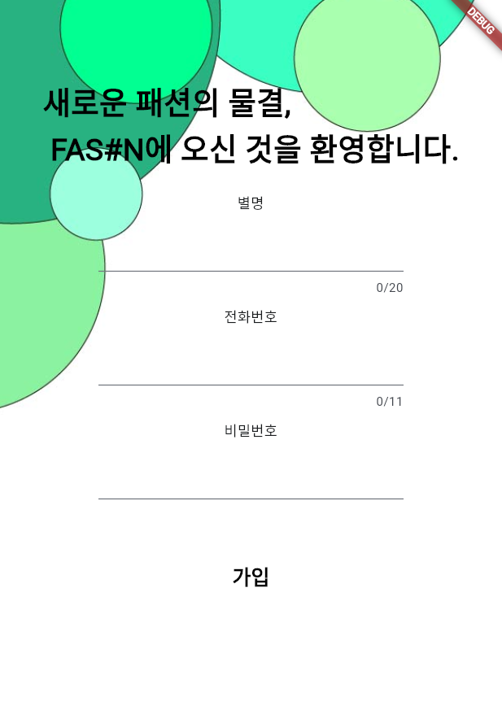
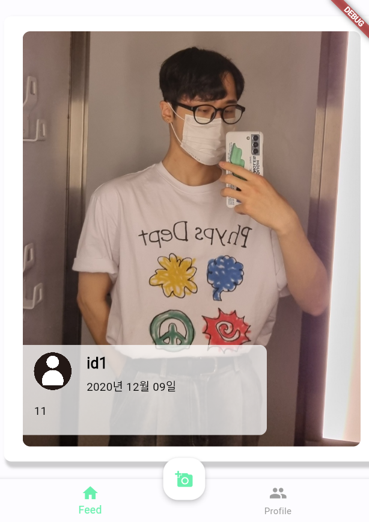
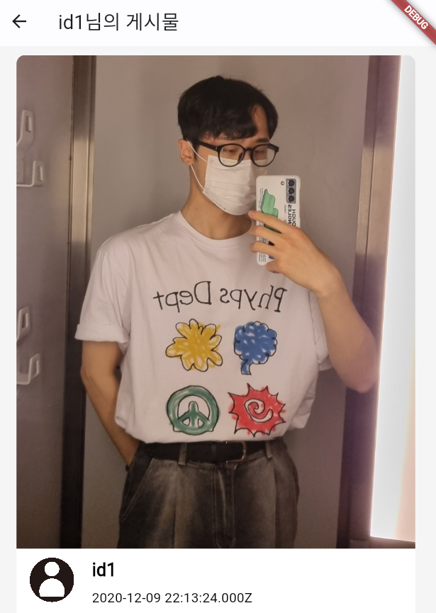
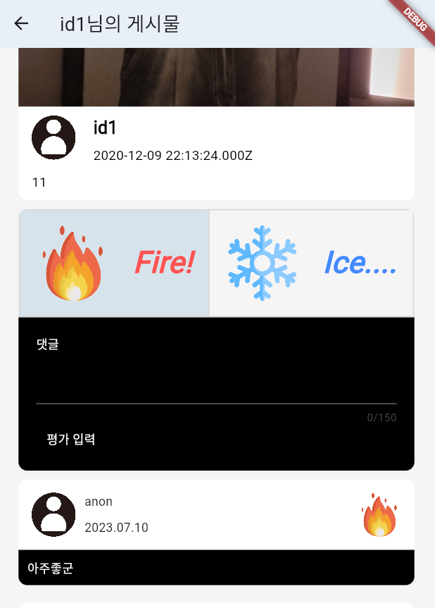
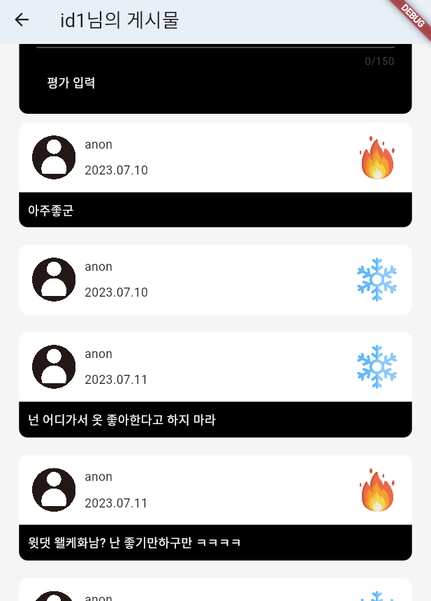
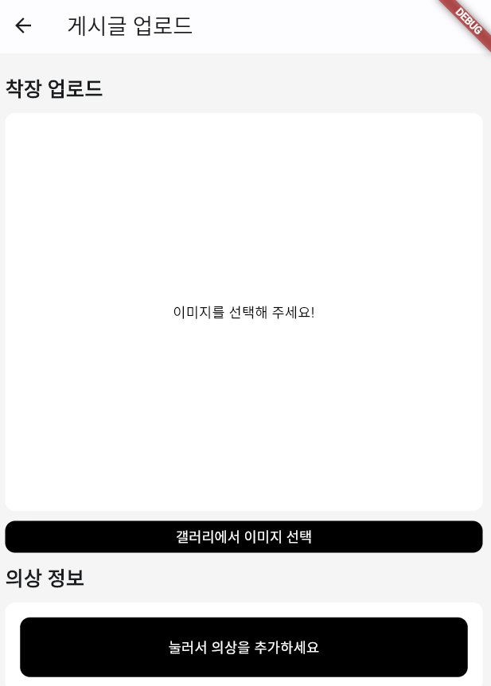
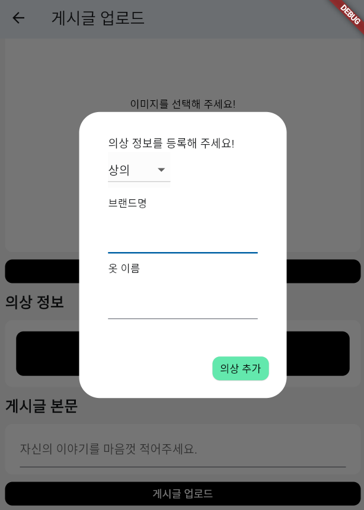
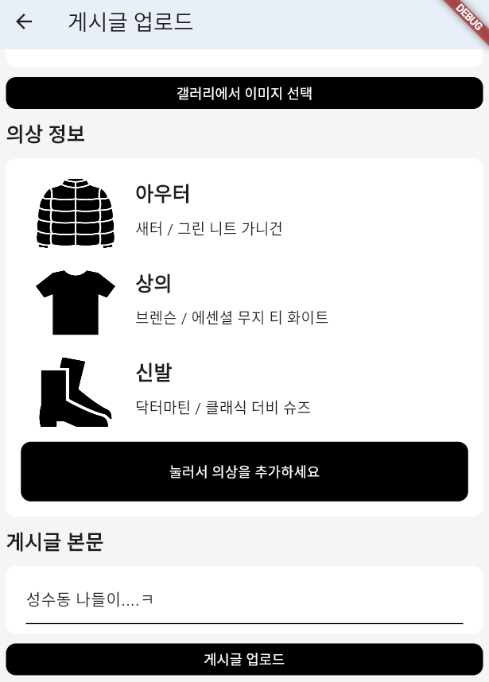
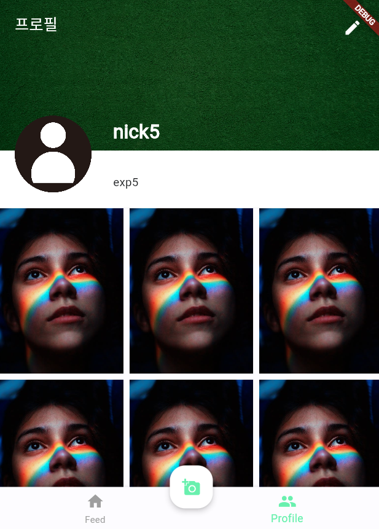

# 2023학년도 여름학기 몰입캠프
## 2주차 프로젝트
- **분반** : 3
- **팀원** : 김현호, 송민지
- **프로젝트 이름** : FAS#N
- **프로젝트 설명**

  - **사용 tool** : 서버 - Node.js / DB - MySQL / 앱 개발 - Flutter
    
    
  - **프로젝트 기능 요약** : 패션 정보 공유 앱
 
    
  - **상세 설명**
    

## 1. 로그인

</img> </img>

## 2. 피드

</img>

-횡스크롤으로 게시글을 보면서 의상 착장을 더욱 자세히 볼 수 있음

## 3. 게시글 상세

</img> </img> </img>

- 게시글 내에서는 글을 끝까지 볼 수 있음
- hot/ cold로 평가 가능
- 선택적으로 댓글 남길 수 있음
- 다른 사람들의 댓글 볼 수 있음

## 4. 게시글 업로드

</img> </img> </img>

- 이미지 1장, 입은 옷의 정보, 글의 본문을 작성 가능
- 입은 옷 정보는 AlertDialog를 사용해서 작성, 리스트에 계속 추가 가능

## 5. 프로필

</img>

- 자신이 쓴 글들을 gridView를 사용해서 볼 수 있고, 개인정보를 게시 가능
